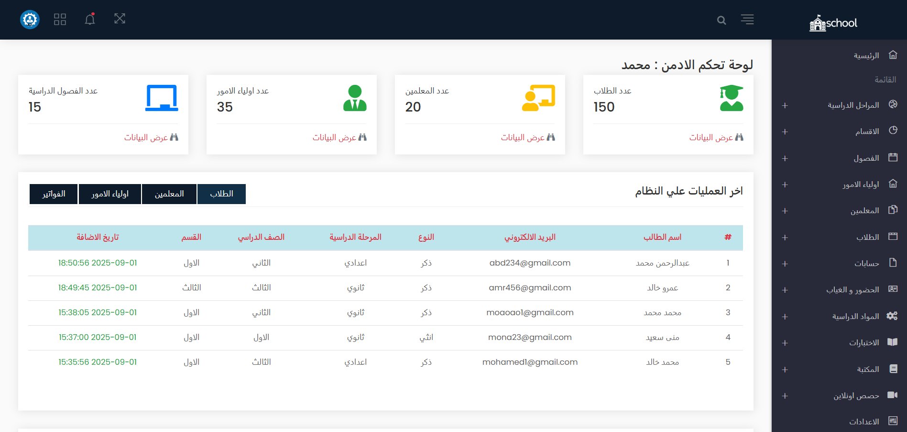
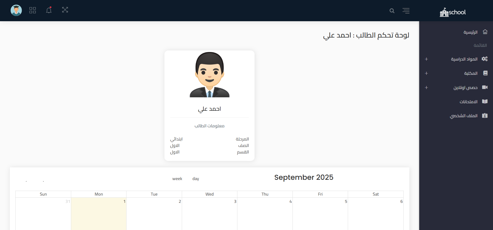
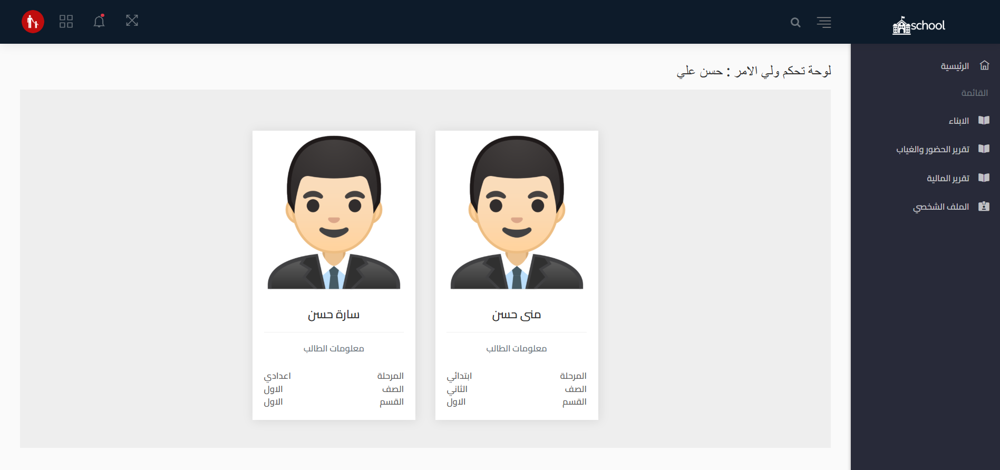
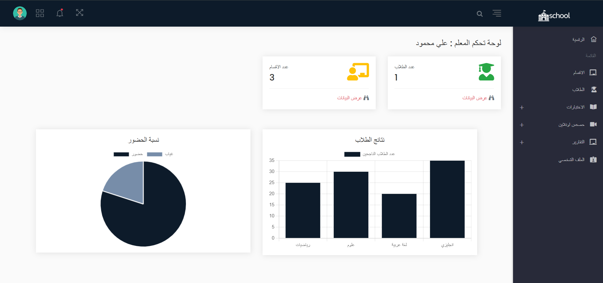

  

#  School Management System

A **School Management System** built with **Laravel** that helps manage students, teachers, parents, and administrators through a simple and user-friendly dashboard.  

---

##  Features
-  **Student Dashboard**: View student information, class schedule, and attendance.  
-  **Parent Dashboard**: Monitor children, attendance reports, and financial reports.  
-  **Teacher Dashboard**: Manage students, track attendance, and publish exam results.  
-  **Admin/Security Dashboard**: Full control over the system (users, permissions, classes, reports, and settings).  
-  Online library for learning materials.  
-  Online exams system.  
-  Visual reports and charts to analyze student performance.  

---

##  Screenshots

###  Admin / Dashboard

###  Student Dashboard

###  Parent Dashboard

###  Teacher Dashboard

---

## Tech Stack
- php
- Laravel 11  
- MySQL  
- Blade Templates  
- Bootstrap & CSS  
- Chart.js (for visual reports)  

